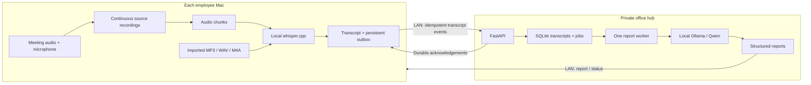

# MeetingBox architecture

MeetingBox distributes speech recognition across employee Macs running macOS 15 or newer and serializes meeting analysis on a Radxa Cubie A7A private office hub. These platform targets are confirmed. Each Mac owns its recording and transcript until the hub acknowledges durable receipt. The hub owns the shared transcript history and generated reports. Runtime inference requires locally installed models; it has no intended dependency on a commercial AI API.



## Runtime locality

Install dependencies and model weights before the demonstration, then run with the WAN disconnected while retaining the LAN. Context7 and Sosumi are development documentation services, as described in [tooling.md](tooling.md), and must not be called by the product. MeetingBox must not silently substitute a cloud model if a local model fails.

Run Ollama on the hub’s loopback interface and disable its cloud features. These environment settings belong to the Ollama service process:

```sh
OLLAMA_HOST=127.0.0.1:11434
OLLAMA_NO_CLOUD=1
OLLAMA_NUM_PARALLEL=1
OLLAMA_MAX_LOADED_MODELS=1
```

Restart Ollama after changing its environment and confirm its log reports cloud features disabled. The loopback default and these controls are documented in the [Ollama FAQ](https://docs.ollama.com/faq). Only the authenticated MeetingBox API should be reachable from employee Macs. Installing a model is a separate provisioning operation; a request handler should never pull one automatically.

The prototype uses a shared bearer token for a trusted hackathon LAN. That token does not provide user isolation, and plain HTTP does not encrypt transcripts or credentials in transit. Use TLS or a private encrypted tunnel for real office deployment, then replace the shared credential with device pairing and per-meeting authorization. Recordings and SQLite data are ordinary local files; storage encryption and retention policy are deployment work, not guarantees provided by this prototype.

## Capture and transcription

Start the meeting locally with a client-generated UUID before attempting any network operation. The Mac can therefore begin recording with the hub unavailable. System audio and microphone audio are retained as separate sources. The transcript labels `local` and `remote` refer to microphone and system audio respectively; they do not identify individual remote participants.

Full-session recording and transcription have independent lifecycles. Short chunks are units of speech-recognition work, never the recording duration. Every chunk needs a meeting-relative start offset so Whisper timestamps can be placed on the shared timeline. Process chunks serially per Mac, preserve failed work, and expose backlog status rather than blocking capture on inference or network latency.

The current archive stores full-duration, 16 kHz mono source audio in CAF files and publishes 12-second PCM WAV chunks for transcription. “Full recording” refers to duration; this is a speech-oriented archive rather than an original-format, multichannel master. Allow approximately 660 MiB per hour for two full source tracks plus retained WAV chunks before any cleanup, excluding imported originals and models.

The initial integration invokes a local `whisper-cli` executable against a user-provided model. This is simple to inspect and replace. A persistent Whisper library or worker can later remove per-chunk model-loading overhead. whisper.cpp documents Apple Silicon acceleration through Metal and optional Core ML, but actual acceleration depends on the installed build and model assets. [whisper.cpp documentation](https://github.com/ggml-org/whisper.cpp#readme).

Imported MP3, WAV, and M4A recordings are decoded locally into a format accepted by the same transcriber, then follow the same transcript-to-report path. Saved CAF source recordings can also be imported for recovery. The initial file mode runs on the Mac. Standalone audio upload and transcription on the hub are separate future work; do not demonstrate the Mac path as appliance-only transcription.

For capture validation, play known remote speech while speaking into the microphone, then inspect both source recordings and transcript timestamps. Headphones reduce acoustic echo from remote output entering the microphone. Exact digital silence is skipped for inference. Robust voice activity detection, speaker diarization, overlap handling, and boundary-context improvements are distinct tasks from source capture.

## Delivery and finalization

The protocol uses one meeting UUID and a monotonically increasing sequence number for each immutable transcript event. The Mac stores an event before sending it. The hub commits an event to SQLite before acknowledging it. A retry of the same meeting/sequence and payload is harmless; reusing a sequence with changed content is an error. Resume from the highest contiguous acknowledgement so gaps are never treated as complete.

Events may be delivered out of timestamp order because sources finish transcription at different times. Sequence numbers establish delivery completeness; timestamp sorting establishes conversation order. Keep those meanings separate.

Stopping is a barrier, not an immediate report request:

1. Stop capture and finalize each source recording.
2. Close the final partial chunk and finish all queued transcription.
3. Persist and deliver every final transcript event.
4. Request finalization with the last sequence number.
5. Let the hub queue final analysis only after it has that complete sequence.

If the LAN drops, recording and local transcription continue. Persisted events retry after reconnection. The audio pipeline writes an ingestion-complete marker only after capture or file decoding finishes successfully. After interruption, retrying can process already published chunks, but missing that marker prevents the app from finalizing an incomplete transcript. Reimport the complete saved recording or original file into a new meeting to recover it. The importer accepts saved CAF sources directly. Reimporting the microphone and system CAF files creates separate meetings; this MVP does not automatically merge their transcripts into one recovered meeting. Recovery can process only audio actually present in readable saved files.

Already written recordings and transcript events remain on disk after an app exit. One unreadable meeting metadata file is reported by filename while healthy meetings still load. Disk exhaustion, permission revocation, and abrupt power loss can still interrupt capture; a local-first design is not a promise that recordings can never be lost.

## Analysis and report accuracy

The hub uses SQLite-backed jobs and one inference worker. Coalesce live analysis work so a slow model does not build an unbounded queue of obsolete snapshots. Different meetings can continue ingesting text while Qwen processes a previous job. Run one backend process for this prototype; multiple independent worker processes require coordinated job claiming and leases.

A full hour can exceed the selected model’s context window. Process the normalized transcript chronologically in bounded windows, carrying a bounded structured report between windows. Final reconciliation must account for later changes to owners, deadlines, decisions, and open questions. For example, “Dana will send it Friday” followed by “Timur will send it Monday instead” should end with one current action item assigned to Timur.

Bounded reconciliation makes memory use manageable; it can still lose earlier details when reports are compressed. Keep the immutable transcript and include transcript sequence references with extracted facts so users can inspect evidence. Validate model output against a JSON schema and retain a visible failed state when output cannot be parsed. Local execution does not establish factual accuracy. Treat transcripts as data, including any spoken instructions directed at an assistant; report generation should not gain shell, network, or messaging tools.

SQLite meeting history is the first persistence layer. Semantic RAG, embeddings, cross-meeting question answering, centralized recording archives, and multi-user access controls are follow-on features. Their presence in the product vision should not be confused with the current MVP.

## Board selection and performance gates

The board is confirmed as **Radxa Cubie A7A**, based on the Allwinner A733 with two Cortex-A76 and six Cortex-A55 CPU cores. Radxa lists LPDDR5 configurations of 2, 4, 6, 8, 12, and 16 GB, plus a 3 TOPS NPU. The RAM capacity, operating system image, storage, and cooling on this particular unit are still unknown. [Official Radxa specifications](https://docs.radxa.com/en/cubie/a7a).

Treat CPU inference as the baseline until the installed driver stack, model format, and inference backend have been verified together. The current Ollama integration does not configure A733 NPU acceleration. An advertised NPU throughput figure does not establish Qwen support or a meeting concurrency limit.

Benchmark the intended multilingual recordings on the actual machines. Select the smallest local Whisper and Qwen models that meet the quality target; record model file hashes or digests, quantization, runtime versions, context length, and hardware details with the result.

| Measurement | How to assess it |
| --- | --- |
| Mac transcription throughput | Total processing time divided by total captured audio duration, including both sources and model startup; sustained ratio below 1 is necessary to keep up |
| Live analysis capacity | With N meetings updating every T seconds and mean inference time S seconds, utilization is approximately N × S / T; leave headroom below 1 |
| Final report latency | Measure stop-to-complete time, including transcription drain, queue wait, and every reconciliation window |
| Memory and thermals | Track peak resident memory, swap, temperature, and throttling during a sustained run |
| Report quality | Check owners, changed deadlines, unsupported decisions, omissions, and evidence references against a human-marked transcript |
| Recovery | Disconnect LAN, restart the hub during a job, reconnect, and verify contiguous events and a single completed final report |
| Runtime egress | Provision first, disconnect WAN while keeping LAN available, and complete capture/import/report/export; inspect process traffic if making a zero-egress claim |

The queue formula is a planning approximation, not a measured capacity promise. If utilization grows too high, lengthen the live interval, reduce report size, coalesce more aggressively, or disable live extraction while preserving final reports. A two-minute demonstration should be accompanied by a longer capture test: short demos conceal model reload cost, thermal throttling, and slowly growing backlogs.
